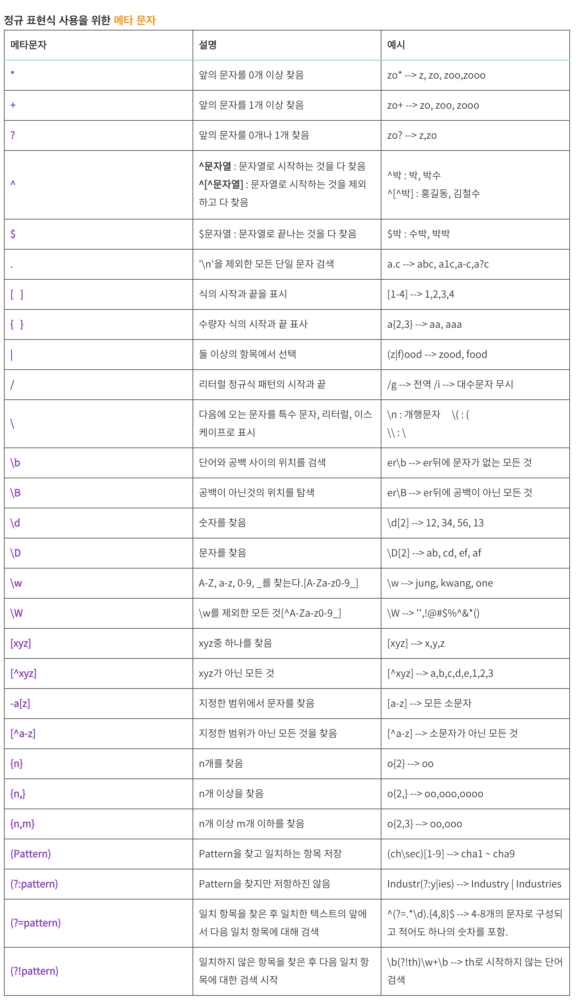

# 몽고 DB

# MongoDB Docker 설치

## MACOSX - VERSION
<pre>
<code>

$ docker pull mongo
$ docker run --name mongodb-container -v ~/data:/data/db -d -p 27017:27017 mongo

// mongoDB 기본 포트 27017

// 컨테이너 접속 후 

$ mongo

</code>
</pre>

# 개념

## Document
### Document는 RDMS의 record 와 비슷한 개념으로 이의 데이터 구조는 한개 이상의 key-value 한쌍으로 이뤄져있습니다. 
<pre>
<code>
  {
    "_id": {
      "$oid": "64ba4b72eb9aa8df1b0fa4a0"
    },
    "02": "값02"
  }
</code>
</pre>

### id : 12Bytes 의 hexadecimal값 Document 내에 유일함(uniqueness)을 제공한다.

db.컬렉션01.find({ "Key": "Value" }) <- 키-값을 입력해서 조회할 수 있다.

## Collection

### Document들이 Collection내부에 위치하고 있으며, RDMS의 table과 비슷하지만 RDMS와 달리 schema를 갖고 있지 않다.

show collections <-으로 컬렉션 document 포함 목록 조회
db.collection.getCollectionNames() <- 컬렉션 이름만 조회
db.collection.find()
db.collection.find(name, option)  

## Database
### Database는 Collection들의 물리적인 컨테이너 저장소.
show dbs <- DB목록 조회

## DataType
1. null {'x' : null}
2. boolean {'x' : true}
3. 숫자 {'x' : 3},{'x' : 3.14} // 64bit 부동소수점 수를 기본
4. {'x' : NumberInt('3')}, {'x' : NumberLong('3')} 4byte, 8byte 정수는 NumberInt, NumberLong 클래스를 사용
5. 문자열 {'x','footer'} 어떤 UTF-8 문자열이든 문자열형으로 표현가능
6. 날짜 : 1970년 1월 1일부터 시간은 1/1000초 단위로 나타내며 64비트 정수로 날짜를 저장 표준시간대를 저장하지 않는다.
   1. {'x' : new Date()}
7. 정규표혆식 : 자바스크립트의 정규 표현식 문법을 사용할 수 있다.
8. 배열 : 값의 set, list를 배열로 표현할 수 있다.
   1. 정렬 연산(list, stack, quere)와 비정렬 연산(set)에 호환성 있게 사용가능하다.
9.  inner Document {'x',{'foo' : 'bar'}}
10. 객체 ID : {'x' : ObjectId()} document용 객체ID는 12바이트이다.
11. 함수 : {'x' : funcgion(){/* ... */}} query와 document는 자바스크립츠 코드를 포함할 수 있다.
12. 이진데이터 : 바이트 코드

## Naming Role
### Collection Naming
1. 카멜케이스 혹은 소문자를 사용하되, 소문자 권장
2. 120bytes 이하
3. 복수형 권장 (students, emplotyees)
4. 구분자를 포함하는 것을 권장 '-' , '_'
5. 공백문자, 널 문자, System 접두사 사용 금지

### Field Naming
1. CamelCase
2. PasCalCase
3. 소문자
4. Null 문자, 공백 문자, ,.을 포함해서는 안된다.
5. $기호로 시작할 수 없다.
6. 구분자 '-' , '_'를 사용하지 않아도 된다.

## Regex Pattern
1. **i(ignore case)** : 대소문자 구별 안함
2. **m(multi line)** : 여러 줄
3. **x** : 모든 공백 및 주석 무시
4. **s** : 개행 문자 포함 
5. **g(global)** : 문자열 내의 모든 패턴 검색
6. **u(unicode)** : 유니코드 전체를 지원
7. **y(sticky)** : 문자 내 특정 위치에서 검색을 진행 'sticky' 모드를 활성화

## 비교 순서
데이텨형을 비교하는 위계구조(hierarchy)가 존재,
1. min 최소값
2. null
3. 숫자(int, long, double, decimal)
4. 문자열
5. 객체/도큐맨트 (object / document)
6. 배열
7. 이진데이터
8. 객체ID
9. boolean
10. date
11. timestamp
12. regex
13. max 최대값

## Meta Charactor

# 참고자료 및 링크
### [1. MongoDB Homepage Manual Reference](https://www.mongodb.com/docs/manual/reference/)
### [2. Inpa-Dev](https://inpa.tistory.com/entry/MONGO-%F0%9F%93%9A-%EB%AA%BD%EA%B3%A0%EB%94%94%EB%B9%84-%EC%BF%BC%EB%A6%AC-%EC%A0%95%EB%A6%AC#%EC%BB%AC%EB%A0%89%EC%85%98_%EC%A1%B0%ED%9A%8C)