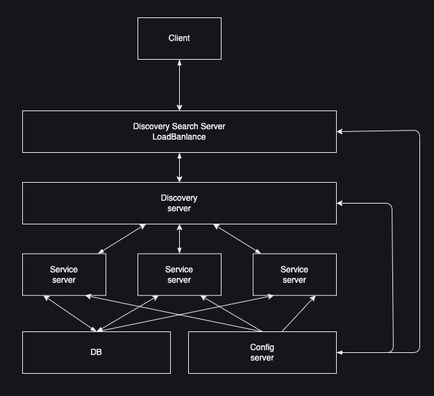

# Tutorial
1. actuator 통한 헬스 체크 체험
2. HATEOS를 통한 경로 정보 전달 체험
3. 국제화 메시지 locale 처리 체험
   

# SpringConfig
경로별 접근방법  
1. /{application}/{profile}[/{label}]  
2. /{application}-{profile}.yml  
3. /{label}/{application}-{profile}.yml  
4. /{application}-{profile}.properties  
5. /{label}/{application}-{profile}.properties  

# DiscoveryService
DiscoveryClient
OpenFeign

# 프로젝트 구성 서버 관계

1. [ConfigServer](./springConfig/cloudConfig/)
   1. 환경 설정 서버
   2. 각 서버에 환경 설정을 갖고 있는 서버
2. [serviceServer](./springConfig/cloudHamony/)  
   1. 서비스 서버
   2. 서비스의 로직을 담당하는 서버
   3. Resilience4j를 통한 서비스 회복
      1. **CircuitBreaker** : 회로 차단, 서비스가 실채할 때 요청 중단
      2. **bulkedhaed** : 과부하 방지. 동시 호출 서비스 요청 수 제한
      3. **rateLimiter** : 한 번에 수신하는 호출 수 제한
      4. **retry** : 서비스가 일시적으로 실패할 때 재시도
      5. **fallback** : 실패하는 요청에 대해 대체 경로 설정
3. [eurekaServer](./serviceDiscovery/eurekaClient/)
   1.  디스커버리 서버
   2.  서비스 검색이 가능하게 해준다.
4. [serviceSearchServer](./serviceDiscovery/discoveryClient/)
   1. 서비스 검색 서버
   2. 로드 밸런스

