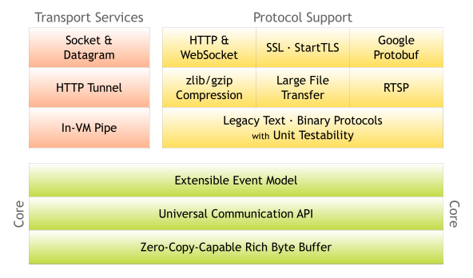

# Blocking & Non-Blocking I/O

## Netty Framework란? [Link](https://netty.io/)

# 특징
## Blocking I/O
 - Blocking I/O는 작업 스레드의 작업이 종료될 때까지 요청 스레드가 차단된다.
 - 스레드가 차단되는 문젤르 보완하기 위해 멀티스레딩 기법을 사용할 수 있다.
 - 멀티스레딩 기법 사용시 컨텍스트 스위칭 전화 ㄴ비용, 메모리 사용 오버헤드, 스레드 풀의 응답 지연 등의 문제가 발생할 수 있다.

## Non-Blocking I/O
 - 작업 스레드의 종료 여부와 상관없이 요청 스레드가 차단되지 않는다.
 - 적은 수의 스레드만 사용해 스레드 전환 비용이 적으므로, CPU를 효율적으로 사용할 수 있다.
 - CP를 많이 사용하는 작업의 경우에는 성능에 악영향을 미칠 수 있다.
 - 사용자 요청 처리에 응답까지 전 과정이 Non-Blocking이어야 제대로 된 효과를 얻을 수 있다.

