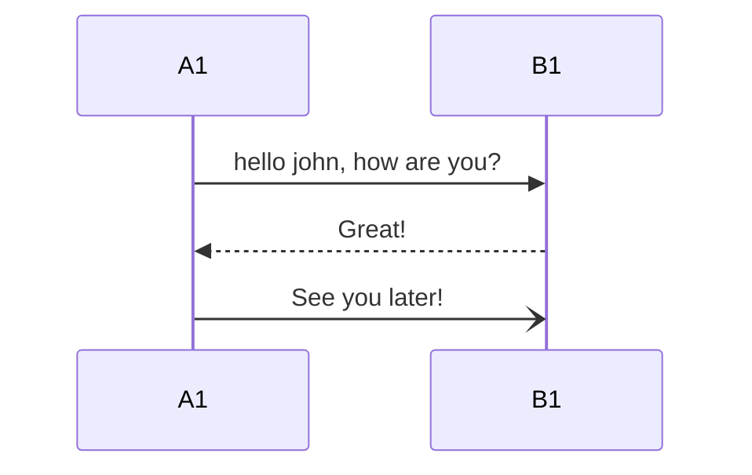
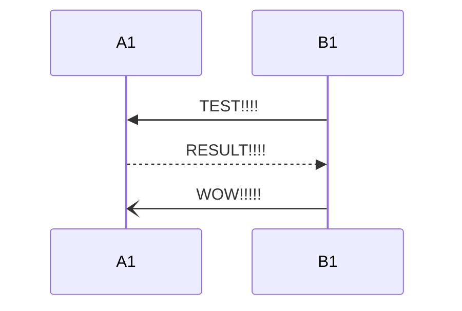
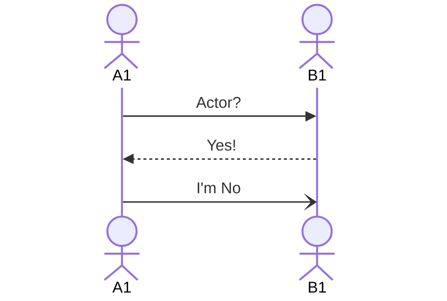
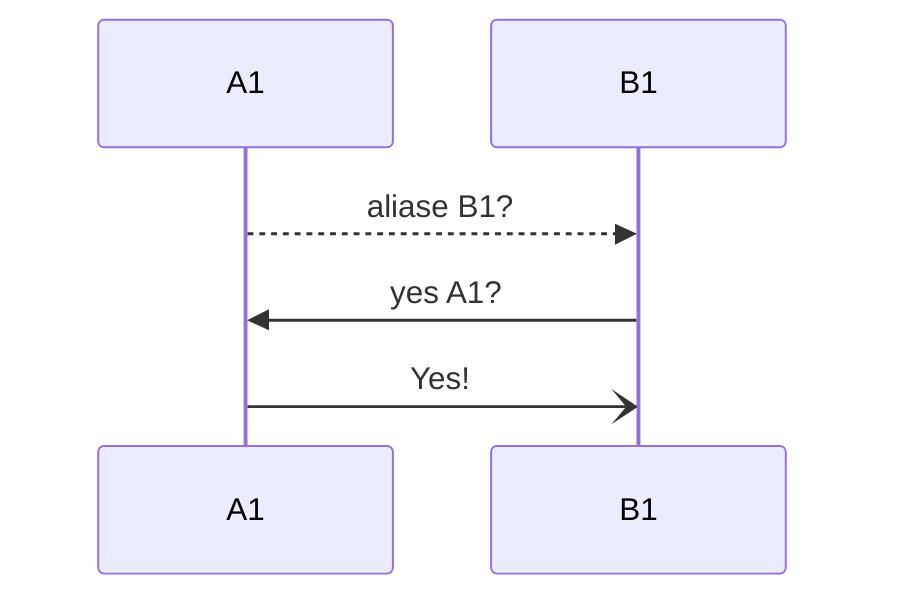
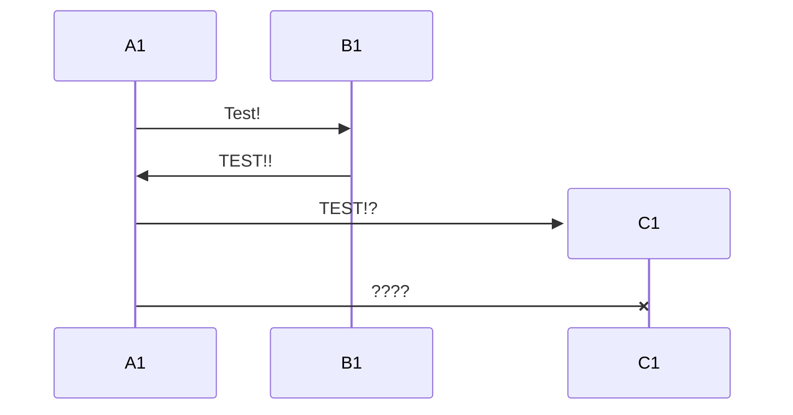
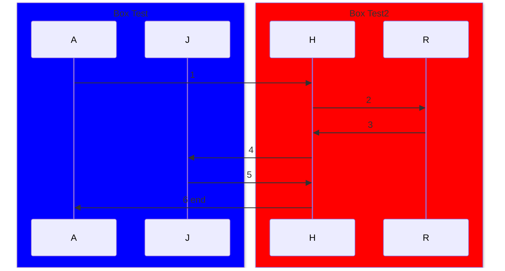
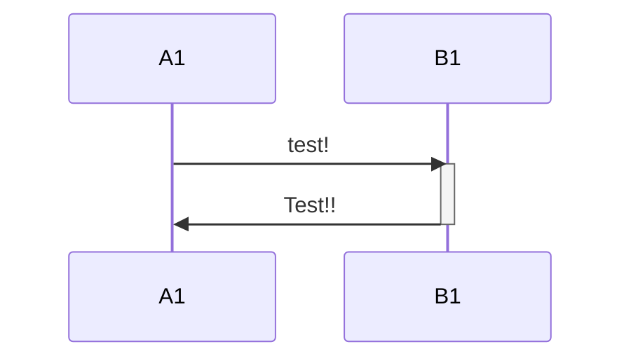
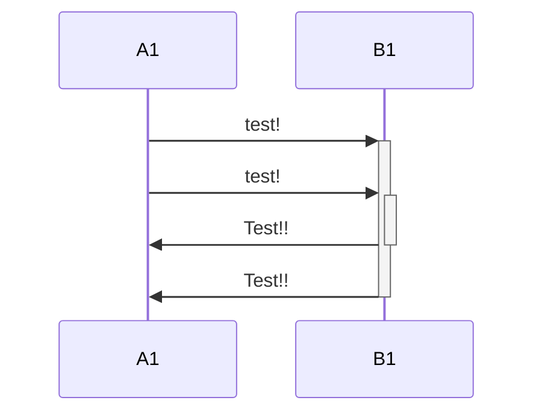
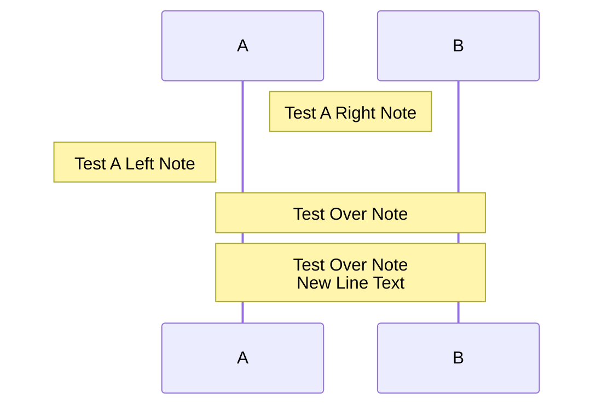

1. participant

2. Actor

3. aliases
   

4. Group Box

5.Messages
|Type | Description |
|----|------|
|->	|Solid line without arrow|
|-->|	Dotted line without arrow|
|->>|	Solid line with arrowhead|
|-->>|	Dotted line with arrowhead|
|-x	|Solid line with a cross at the end|
|--x|	Dotted line with a cross at the end.|
|-)|	Solid line with an open arrow at the end (async)|
|--)|	Dotted line with a open arrow at the end (async)|

6. Activations

7. Notes

