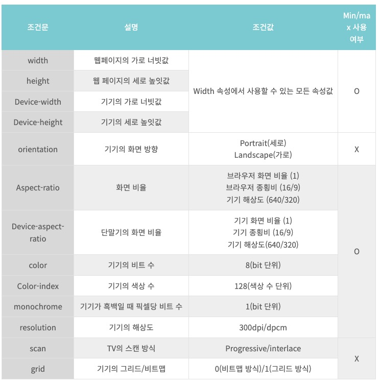

# CSS

## MediaQuery란?

<pre>
<code>
/* @media (조건) {실행문} 조건에 따라 CSS를 추가로 적용할 수 있다.  */
.class{
    width : 80vw
    border 1px solid blue;
}
@media (max-width : 500px){
    .class{
        width : 100vw
        border : 1px solid red;
    }
}
</code>
</pre>

### 사용가능한 조건들
