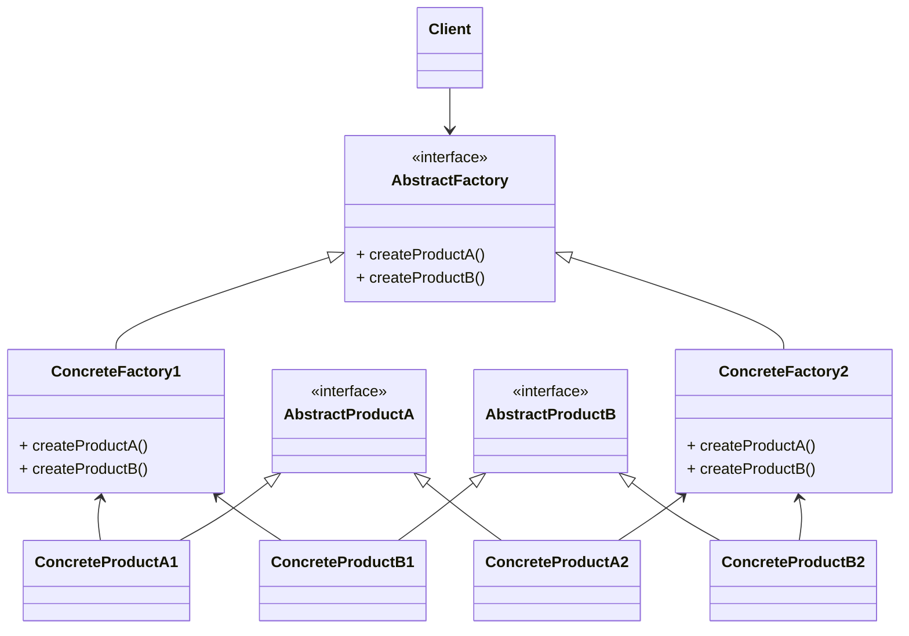

# 추상 팩토치 패턴

### AbstractFactory Vs FactoryMethod
| | AbstractFactory | FactoryMethod |
|---|---|---|
|공통점| 객체 생성 과정을 추상화한 인터페이스를 제공||
|차이점| - 관련 있는 여러개 객체를 구체적인 클래스에 의존하지 않고 만들 수 있게 해는 것이 목록   - 한 Factory에서 서로 연관된 여러 종류의 객체 생성을 지원   - 클래스(Factory) 레벨에서 포커스를 맞춤으로써, 클라이언트의 ConcreteProduct 인스턴스 군의 생성 및 구성에 대한 의존을 감소 | - 구체적인 객체 생성과정을 하위 또는 구체적인 클래스로 옮기는 것이 목적   - 한 Factory당 한 종류의 객체 생성 지원   - 메소드 레벨에서 포커를 맞춤응로써, 클라이언트의 ConcreteProduct 인스턴스의 생성 및 구성에 대한 의조을 감소

### 패턴 다이어그램
