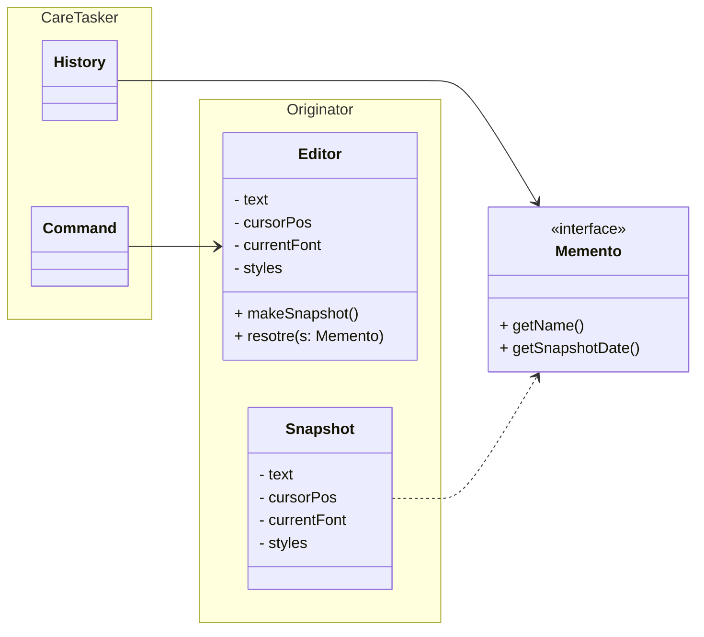
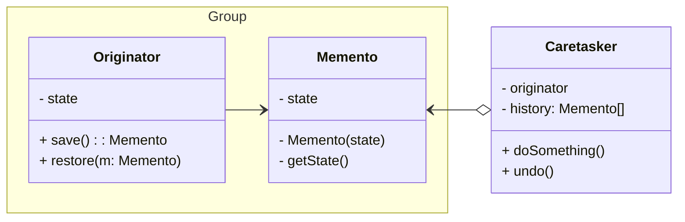

## Memento Pattern

### Overview
- 객체의 구현 세부 사항을 공개하지 않으면서 해당 객체의 이전 상태를 저장하고 복원할 수 있게 해주는 행동 디자인 패턴
- Snapshot으로 불리기도 한다.

### CareTaker(케어테이커)
- 상태 정보가 저장되어 있는 곳
- 내부에 Stack자료형을 가짐으로 Memento 객체를 저장하고 복원한다.

### 적용 해야할 때
- 이전 상태를 복원할 수 있도록 객체의 상태의 스냅샷들을 생성하려는 경우
- 비공개 필드들을 포함하여 객체의 상태의 전체 복사본들을 만들 수 있기 때문에, '실행 취소'와 관련지어 트랜잭션 처리를 하려고 할 때
- 객체의 필드, getter, setter 들을 직접 적즙하는 것이 해당 객체의 캡슐화를 위반할 때

### 장단점
- 캡슐화를 위반하지 않고 객체의 상태의 스냅샷을 생성할 수 있다.
- caretasker가 originator의 state 기록을 유지하돌고 하여 originator의 코드를 단순화 할 수 있다.
- 클라이언트들이 메먼토 패턴을 자주 생성하면 앱의 더 많은 RAM을 소모할 수 있다.(상태 변경에 따른 history가 RAM에 보관된다.)
- caretasker는 쓸모없진 history를 없앨 수 있도록 수명주기를 추척해야 한다.
- javaScript, Python과 같은 동적 프로그래밍 언어에서는 상태가 그대로 유지된다고 보장하기 힘들다.

### 구조 예제

### 중첩된 클래스들에 기반한 구조
1. 

