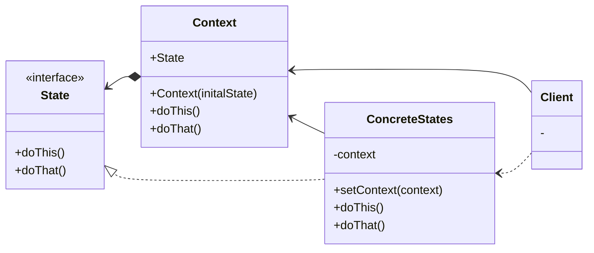

## 정의
- 상태 패턴은 객체의 내부 상태가 변경될 때 해당 객체가 그의 행동을 변경할 수 있도록 하는 행동 디자인 패턴
- 객체가 행동을 변경할 때 객체가 클래스를 변경한 것처럼 보일 수 있다.

## 기본적인 구조

## 적용범위
- 현재 상태에 딸 다르게 행동하는 객체가 있을 때, 상태들의 수가 많을 때, 단 무한하지 않을 때
- 현재 값들에 따라 클래스가 행동하는 방식이 조건문들로 오염될 때 사용
- 상태들의 중복 코드와 조건문 기반으로 행동이 될 때, 상태 클래스들의 계층구조를 구성할 수 있도록 공통 코드는 추상클래스로 추출하여 중복을 줄일 수 있는 방향으로 진행

## 장단점
### 장점
- 단일 책임 원칙.
- 개방 폐쇄 원칙. 상태 클래스들 똔ㄴ 콘텍스트를 변경하지 않고 새로운 상태를 만들 수 있다
- 반복되는 조건문들을 제거 하고 콘텍스트의 코드를 단순화 할 수 있다.
### 단점
- 상태 관리에 의해 행동 변경이 적을 경우, 코드 복잡도가 과할 수 있다.
- 