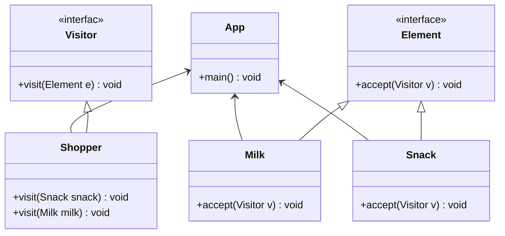

## 정의
- 데이터의 구조와 처리를 분리하는 패턴
- 개방 폐쇠 원칙을 적용하는 방법 중 하나
- 클래스 설계시 특별한 이유가 없는 한 확장을 금지해서는 안된다
- 확장할 때 마다 기존의 클래스를 수정하면 안된다

```mermaid
classDiagram
    class Visitor{
        <<interfac>>
        +visit(Element e) void
    }
    class Element {
        <<interface>>
        +accept(Visitor v) void
    }

    class Shopper {
        +visit(Snack snack) void
        +visit(Milk milk) void
    }

    class Milk {
        +accept(Visitor v) void
    }

    class Snack {
        +accept(Visitor v) void
    }

    class App {
        +main() void
    }

    Visitor <|-- Shopper
    Element <|-- Milk
    Element <|-- Snack

    App <-- Shopper
    App <-- Milk
    App <-- Snack


```