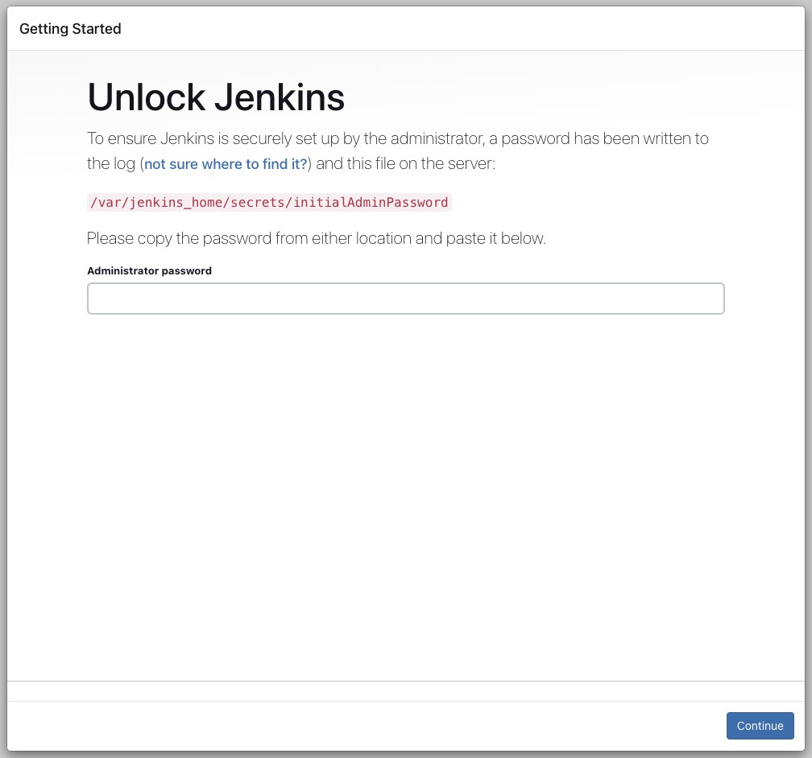
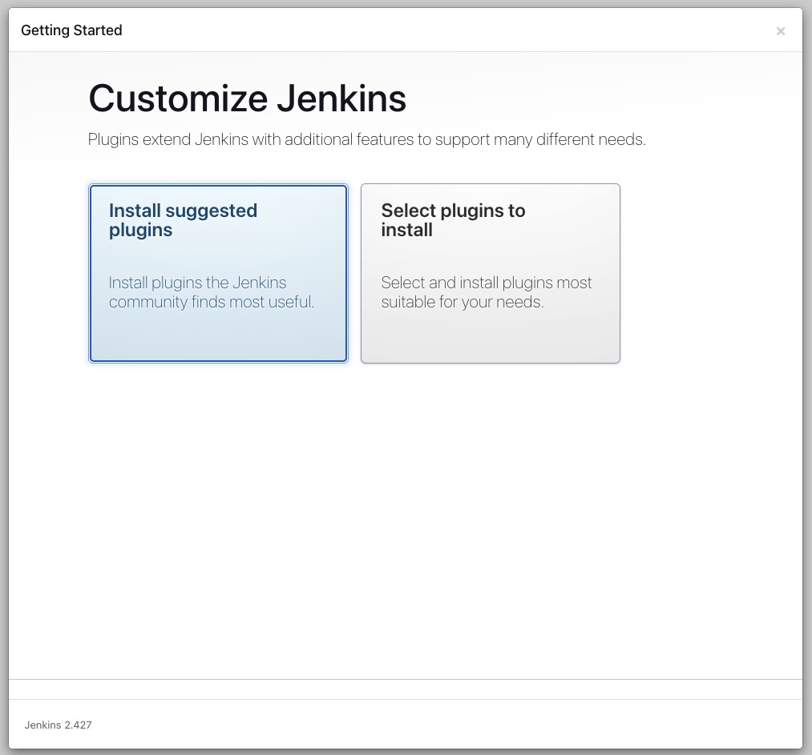
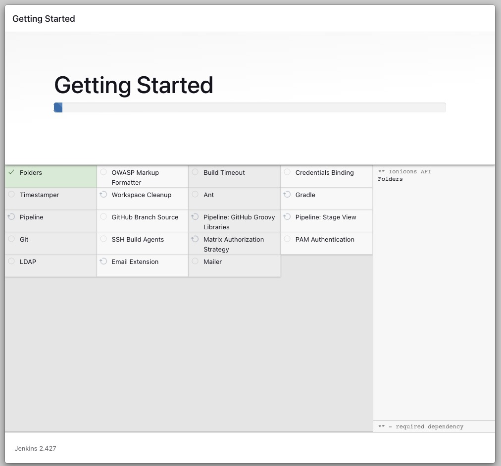
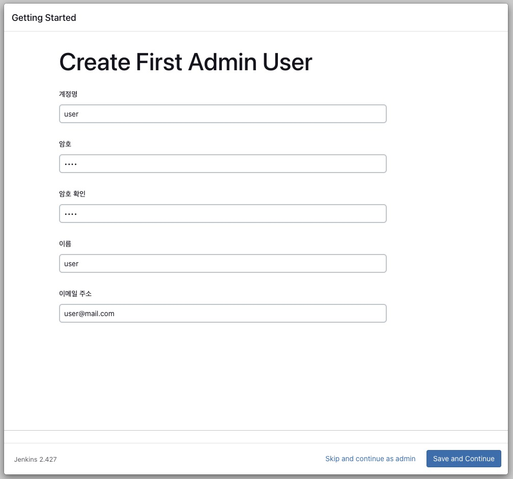
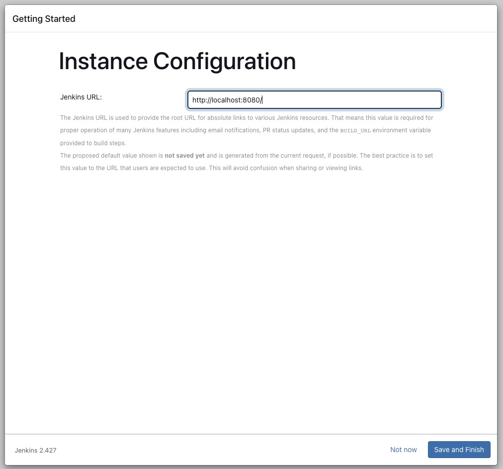
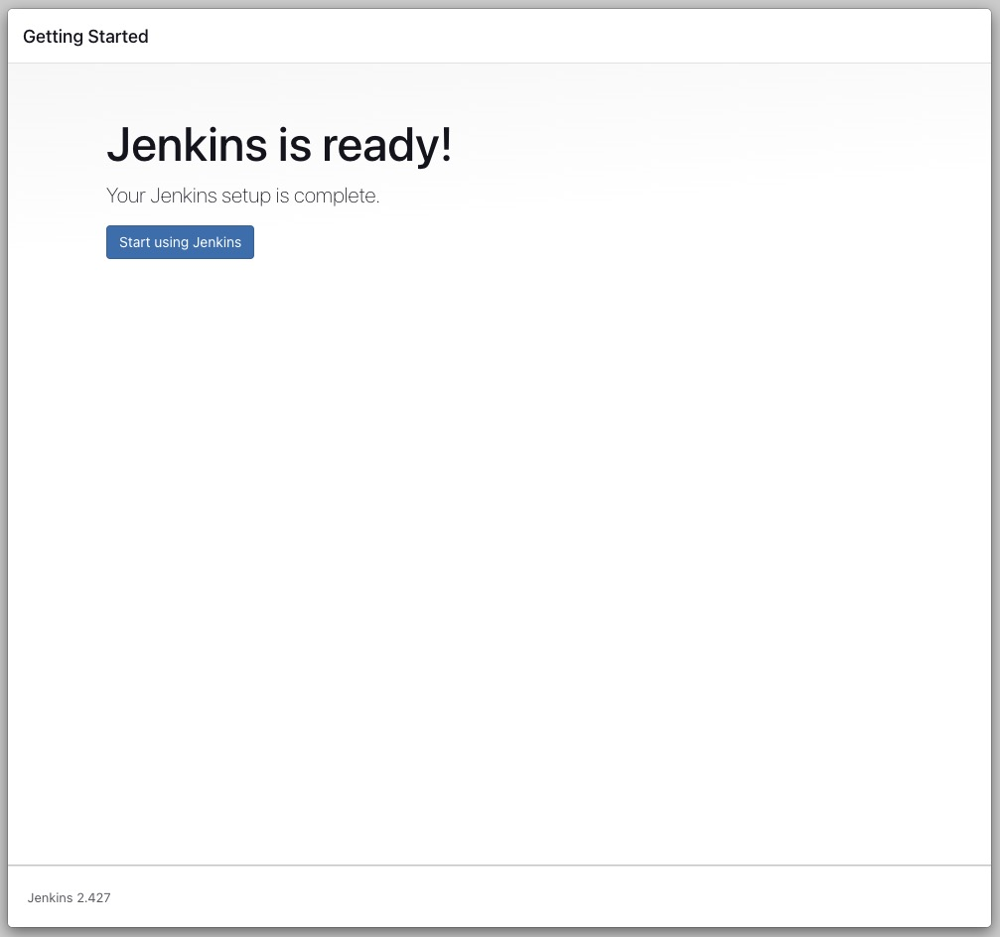

# 1. Install

## 1-1. Docker Version
<pre>
## CLI
docker run -d --name jenkins --restart=on-failure \
-p 8080:8080 \
-v /var/jinks_home:/var/jenkins_home \
-v /var/run/docker.sock:/var/run/docker.sock \
-e TZ=Asia/Seoul \
-u root jenkins/jenkins
</pre>

# 2 Init
### 2-1 [http://localhost:8080](http://localhost:8080/) 접속

### 2-2 초기 비밀번호 입력

<pre>
// 초기 비밀번호 확인
vi /var/jenkins_home/secrets/initialAdminPassword
</pre>

### 2-3 플러그인 설치

### 2-4 init Setting

### 2-3 어드민 계정 생성

### 2-4 Jenkins URL 설정
접속할 Jenkins URL 주소 설정

### 2-5 젠킨스 시작

