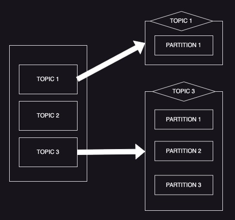
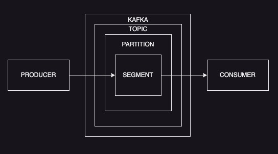
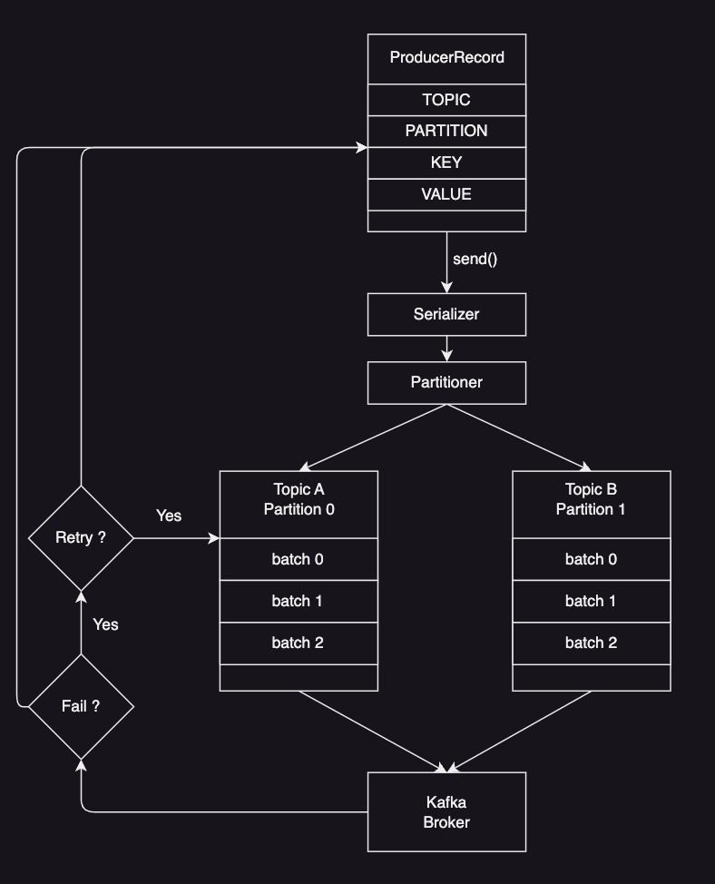

# 카프카 기초

# 카프카를 구성하는 요소
1. ZooKeeper : 아파치 프로젝트 애플리케이션 이름으로 카프카의 메타데이터 관리 및 브로커의 정상상태(health check) 점검을 담당한다.
2. Kafka 또는 Kafka Cluster : 아파치 프로젝트 애플리케이션 이름으로 여러대의 브로커를 구성한 클러스터를 의미
3. Broker : 카프카 애플리케이션이 설치된 서버 또는 노드
4. Producer : 카프카로 메시지를 보내는 역할을 하는 클라이언트 총칭
5. Consumer : 카프카로 메시지를 꺼내가는 역할을 하는 클라이언트 총칭
6. Topic : 카프카는 메시지 피드들을 토픽으로 구분하고, 각 토픽의 이름은 카프카 내에서 고유하다.
7. Partition : 벙렬 처리 및 고성능을 얻기 위해 하나의 토픽을 여러 개로 나눈 것을 말한다.
8. Segment : 프로듀서가 전송한 실제 메시지가 브로커의 로컬 디스크에 저장되는 파일
9. Message 또는 Record : 프로듀서가 브로커로 전송하거나 컨슈머가 읽어가는 데이터 조각

 

# Replication(리플리케이션)
각 메시지들을 여러 개로 복사해서 카프카 클러스터 내 브로커들에게 분산키는 동작을 의미
이 덕분에 예기치 않게 브로커가 종료 되더라도 안정성을 유지할 수 있다.

--replication-factor 3 이라는 옵션을 통해 리플리케이션 수를 지정할 수 있다. 

factor가 많아지면 그 만큼 안정성을 유지할 수 있지만, 그 만큼 리소스를 많이 사용하게 되어, 오버헤드가 발생할 수 있으므로, 효율적으로 사용하길 권장한다.

### **추천 Factor** 
- 테스트나 개발 환경 : 1
- 운영 환경(로그성 메시지로 약간의 유실허용) : 2
- 운영 환경(유실 허용X) : 3

 

# Partition(파티션)
1. 하나의 토픽이 한 번에 처리할 수 있는 한계를 높이기 위해 토픽 하나를 여러개로 나눠 병렬 처리가 가능하도록 만든 것,
2. 파티션의 수 만큼 Consumer를 연결 할 수 있다.
3. 파티선 번호는 0부터 시작 
4. 파티션은 언제든지 수정할 수 있으므로, 초기에는 2~4정도 생성 후, Consumer LAG등 모니터링 하면서 조금씩 늘려가는 것을 추천
5. LAG란, Producer가 보낸 메시지 수(카프카에 남아 있는 메시지 수) - Consumer가 가져간 메지시 수 예를 들어 Producer 5개의 메시지를 카프카로 전송했는데, Consumer 4개를 가져갔다면 5 - 4 = 1 으로 LAG = 1이 된다.   모든 메시지를 가져 갔다면 5-5=0 으로 LAG라는 지표를 통해 지연이 없는지 확인 할 수 있다.
6. 적절한 파티션 수 계산 사이트 https://eventsizer.io 를 참고
   

 

# Segment
Producer에 의해 브로커로 전송된 메시지를 Topic 의 Partition에 저장되며, 각 메시지는 Segment라는 로그 파일 형태로 브로커의 로컬 디스크에 저장된다.

### **흐름도 구조**

 

# 압축 전송
1. 지원하는 대표적인 압축 타입 gzip, snappy, lz4, zstd 
2. 일반적으로 높은 압축률이 필요한 경우 gzip, zstd 권장
3. 빠른 응답 속도가 필요하다면 lz4, snappy 권장

 

# Leader, Follower
1. 리프리케니션 기능은 토픽을 자체를 복제하는 것이 아닌 토픽의 파티션을 복제하는 것
2. 원본과 리플레이션을 구분하기 위해 Leader, Follwer라고 부른다.   
 

# Producer Design

# Producer Option
1. bootstrap.servers : 클러스터 내 모든 서버가 클라이언트의 요청을 받을 수 있다. 클러스터에 처음 연결하기 위한 호스트와 포트 정보를 나타냅니다.
2. client.dns.lookup
   1. 하나의 호스트에 여러 IP를 매핑해 사용하는 일부 환경에서 클라이언트가 하나의 IP와 연결하지 못할 경우 다른 IP로 시도하는 설정
   2. use_all_dns_ips가 기본값
   3. resolve_canonical_bootstrap_servers_only 옵션은 커버로스(Kerberos) 환경에서 FQDN을 얻기 위한 용도로 사용한다.
3. acks
   1. 프로듀서가 카프카 토픽ㄱ의 리더 측에 메시지를 전송한 후 요청을 완료하기를 결정하는 옵션
   2. 0, 1, all(-1)로 표현
      1. 0은 일부 손실를 감수하고 빠르게 전송한다.
      2. 1은 리더가 메시지를 받았는지 확인하지만, 모든 팔로워를 전부 확인하지는 않는다.
      3. all(-1)은 팔로워가 메시지를 받았는지 여부를 확인, 다소 느릴 수 있지만, 하나의 팔로워가 있는 한 메시진는 손실되지 않는다.
4. buffer.memory
   1. 프로듀서가 카프카 서버로 데이털르 보내기 위해 잠시 대기(배치 전송이나 딜레이 등) 할 수 있는 전체 메모리 바이트(byte)
5. compreesion.type
   1. 프로듀서가 메시지 전송 시 선택할 수 있는 압축 타입
   2. none, gzip, snappy, lz4, zstd
6. enable.idempotence
   1. true 중복 없는 전송이 가능
   2. 이와 동시 max.in.flight.requests.per.connection은 5이하, retires는 0이상, acks는 all로 설정해야 한다.
7. max.in.flight.requests.per.connection
   1. 하나의 커넥션에서 프로듀서가 최대한 ACK없이 전송할 수 있는 요청수
   2. 메시지의 순서가 중요하다면 1로 설정 권장, 하지만 성능은 다소 떨어진다.
8. retries
   1. 일시적인 오류로 인해 전송에 실패한 데이털르 다시 보내는 횟수
9. battch.size
   1.  프로듀서는 동일한 파티션으로 보내는 여러 데이터를 함께 배치로 보내려고 시도한다.
   2.  적절한 배치 크기 설정은 성능에 도움을 준다.
10. linger.ms
    1.  배치 현태의 메시지를 보내기 전에 추가적인 메시지를 위해 기다리는 시간을 조정
    2.  배치 크기에 도달하지 못 한 상황에서 linger.ms 제한 시간에 도달 햇을 때 메시지를 전송
11. transactional.id
    1.  '정확히 한 번 전송'을 위해 사용하는 옵션이며, 동일한 TransactionalId에 한해 정확히 한 번을 보장
    2.  옵션을 사용하기 전 enable.idempoptence를 true로 설정
