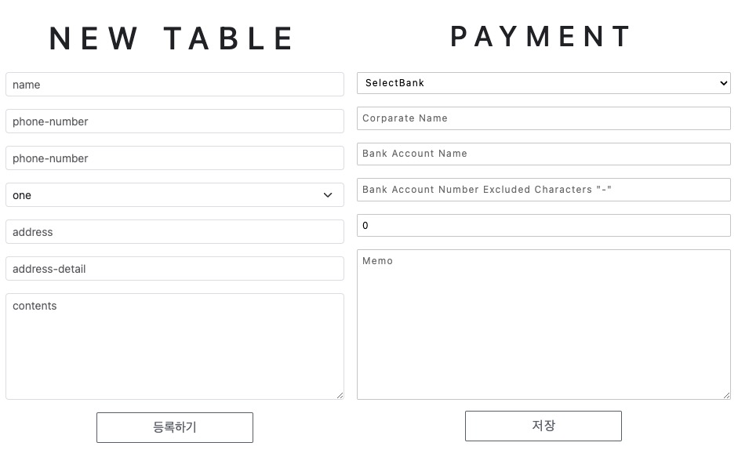
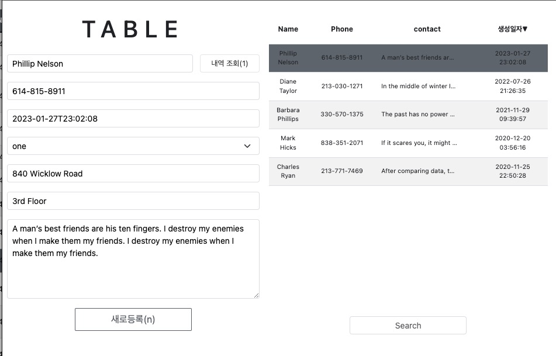
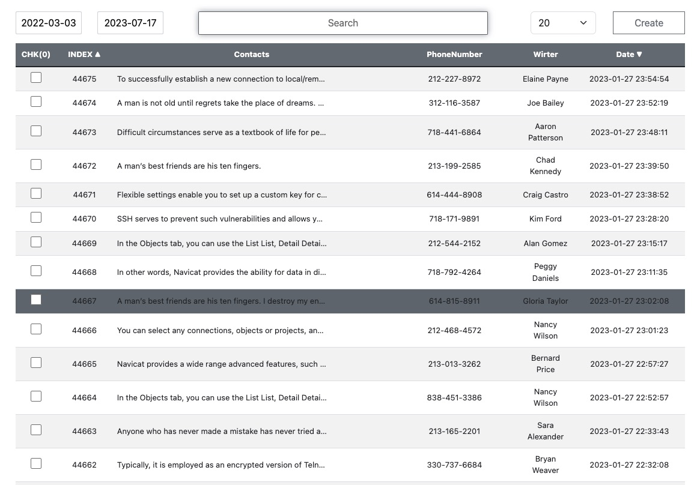
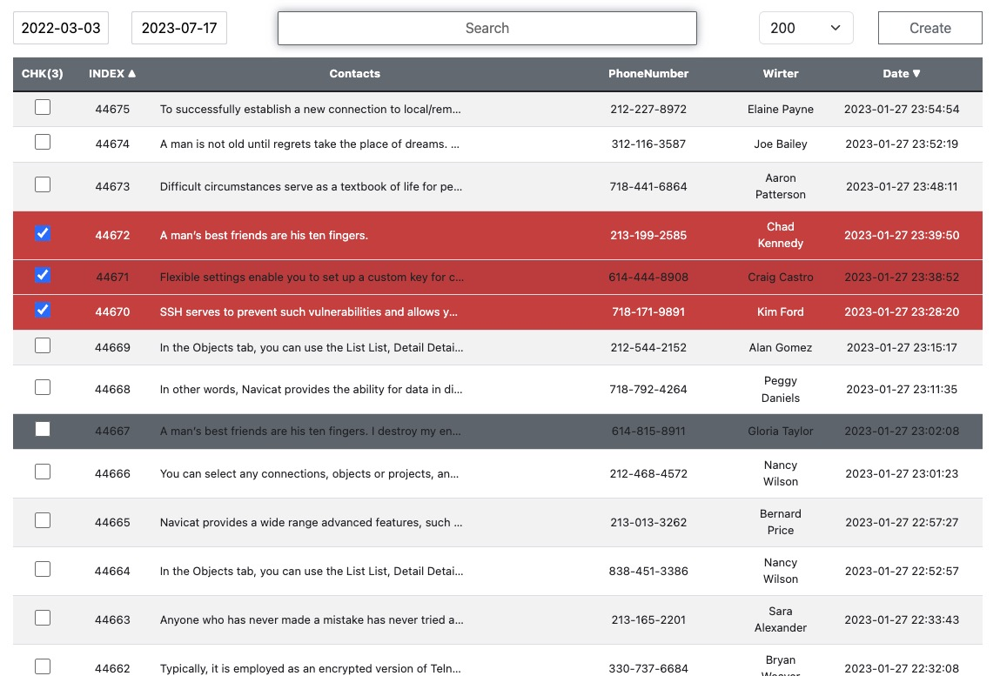

# [고객 상담 CRM](https://github.com/yoosc89/svelte-app-erp) <-Link Github Repository 
고객 상담 사이트로 고객 상담 이력을 추가하고 조회하고, 고객을 조회하고 기존 내역을 조회하는 사이트

# 목적
1. 공부용으로 고객별 상담이력 조회 추가 수정
2. 대용량 DB처리(테스트 DB량 고객 10만건, 내역 100만건) 확인 및 최적화 공부
3. ORM 서브 쿼리 연습
4. Svelte 프론트 프레임워크 학습
5. Docker 무중단 배포, ScretKey 사용
   
 

# TECH STACK

<table>
   <tr>
      <td></td>
      <td></td>
      <td></td>
   </tr>
   <tr>
      <td></td>
      <td></td>
      <td></td>
      <td></td>
   </tr>
   <tr>
      <td></td>
      <td></td>
   </tr>
</table>
DB : Mysql, MariaDB
Language : Python, javaScript  
Makrup Language : CSS  
Backend Framework : Fastapi  
Front Framework : Svelte  
IDE : Vscode  
Platfrom Software : Docker  

 

# 구현 화면
### 고객 정보 등록

### 고객 상담 내역 조회

### 고객 리스트 조히

