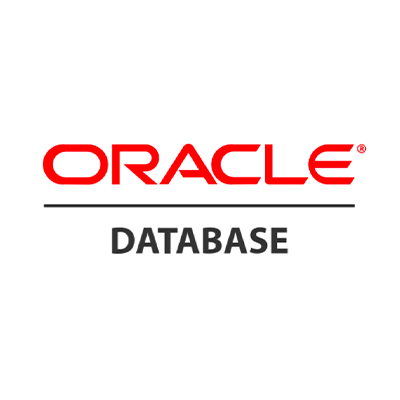

# INFORMATE PROJECT CHATTING SERVER

### TECH STACK
[BackEnd-Kafka&MongoDB](https://github.com/yoosc89/INFOMATE_Kafka_MongoDB) <-Link Github Repository 

### INTRODUCTION
INFOMATE 프로젝트에서 채팅와 알림 서비스를 추가로 제작한 사이드 프로젝트

<table>
    <tr>
        <td></td>
        <td></td>
        <td></td>
    </tr>
    <tr>
        <td></td>
        <td></td>
    </tr>
</table>

1. Framework : nodeJs, ExpressJs, Sequelize
2. db: MongoDB, Oracle
3. Language : javascript

 

# Code Review

### 기본 api router 구조

 

### JWT토큰 검증

 

### 무중단 배포를 위한 pm2 모듈 이용
