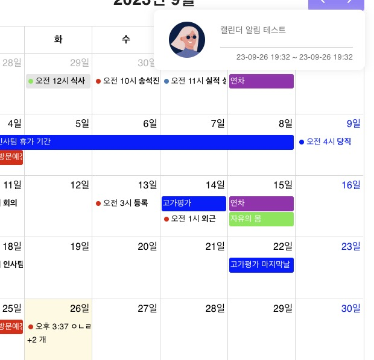
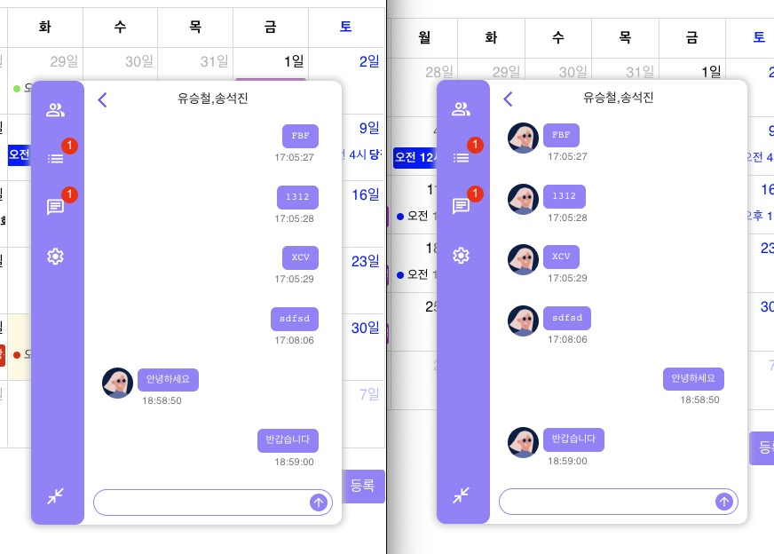
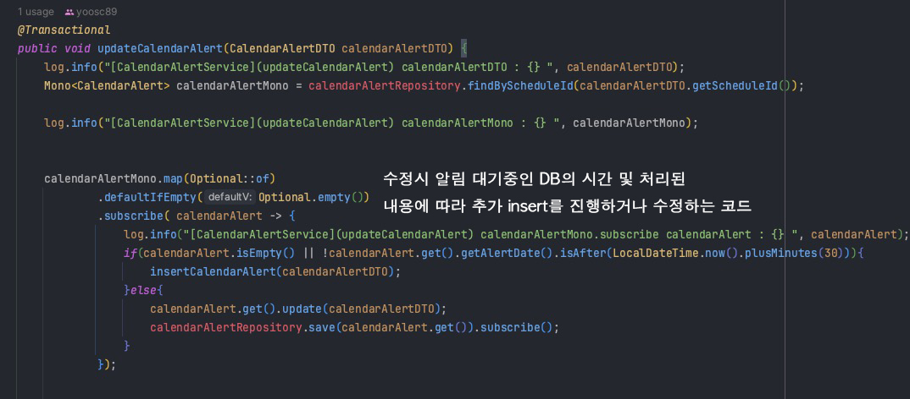
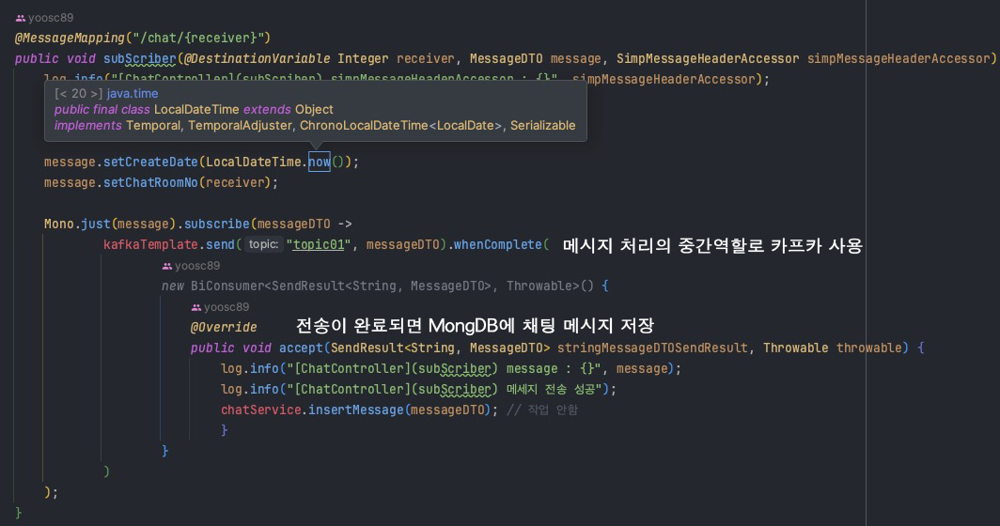
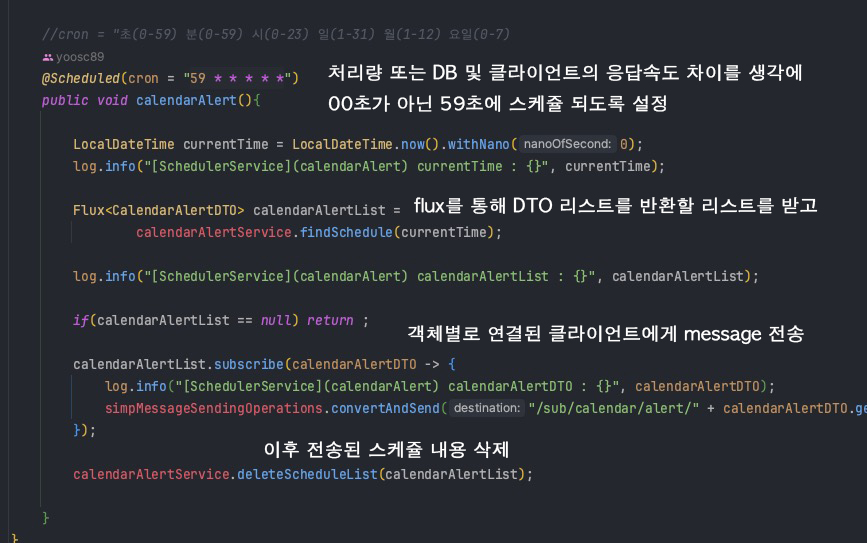

# INFORMATE PROJECT CHATTING SERVER

### TECH STACK
[BackEnd-Kafka&MongoDB](https://github.com/yoosc89/INFOMATE_Kafka_MongoDB) <-Link Github Repository 

### INTRODUCTION
INFOMATE 프로젝트에서 채팅와 알림 서비스를 추가로 제작한 사이드 프로젝트

<table>
    <tr>
        <td></td>
        <td></td>
        <td></td>
    </tr>
    <tr>
        <td></td>
        <td></td>
        <td></td>
    </tr>
</table>

1. Framework : SpringBoot, Kafka, WebFlux
2. db: MongoDB, Oracle
3. WebSocket-STOMP
4. Language : Java

### 2.  Chatting Server Logic Diagram

### 3. Calendar Notification Server Logic Diagram

 

# View

# Code Review

