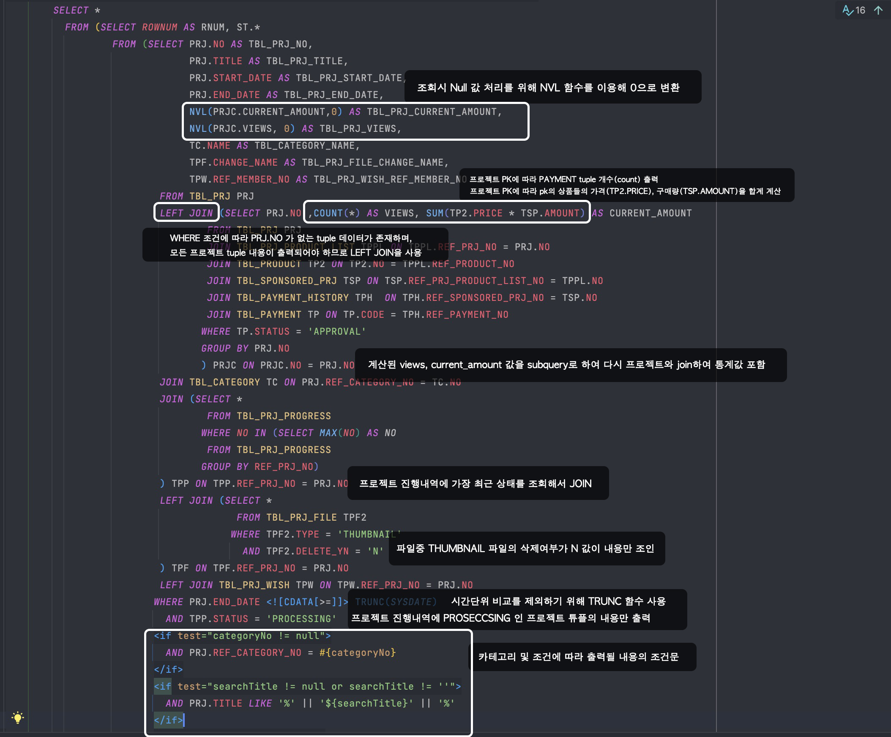
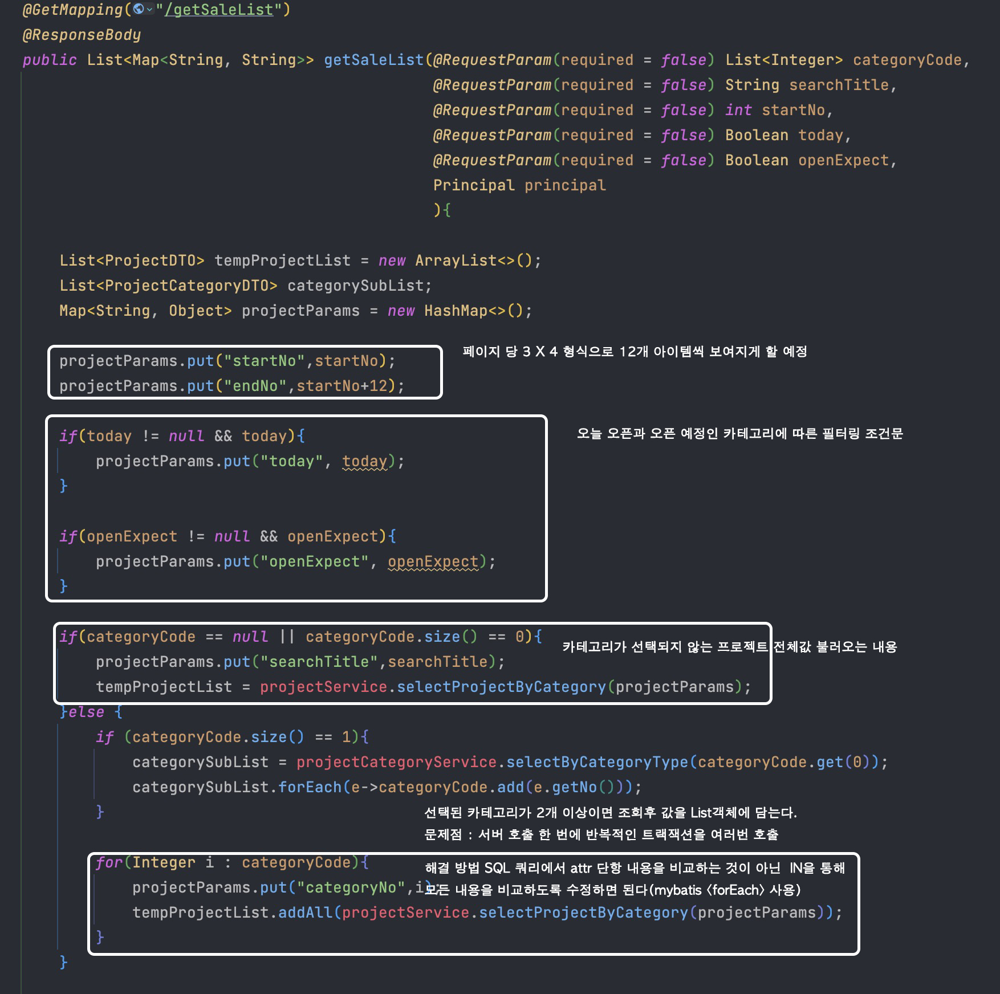
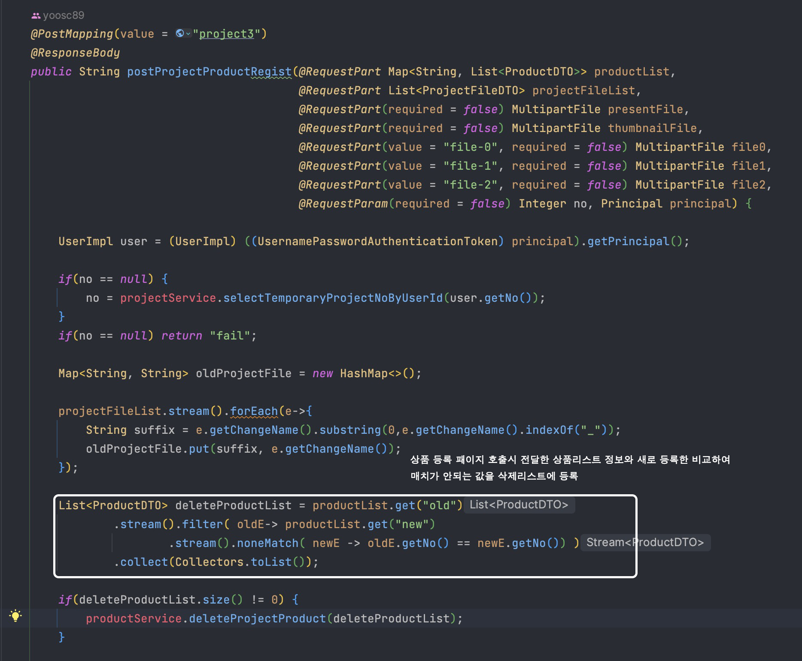

# [OSMAS PROJECT](https://github.com/i-DLE1/OSMASbySpringBoot) <-Link Github Repository

### Other Size, Main Size (기타 사이즈, 우린에겐 메인사이즈)

 

# 프레젠테이션
Link : [Reveal-JS](https://yoosc89.github.io/DevStudy/Project/OSMAS/presentation/)

 

# 기술 스택
DB : Oracle
Language : JAVA, JavaScript  
Markup Language : HTML, CSS  
Backend FrameWork : Spring Boot, MyBatis  
Frontend Library : jQeury, Thyemleaf, Sunediter  
IDE : IntelliJ, VScode, DA#5

 

# 프로젝트 참여 인원(6명)
### 사용자 페이지 2명 - 허**, 홍**
### 판매자 페이지 2명 - 유**, 여** 
### ADMIN 페이지 2명 - 김**, 정**

 

# 담당 내용(판매자 영역)
1. 펀딩 등록 및 수정
   1. 펀딩 정보 등록
   2. 상세 정도 등록
   3. FAQ 등록
   4. 새소식 등록  
2. 펀딩 관리 페이지
   1. 펀딩 취소
   2. 펀딩 통계
   3. 등록된 펀딩 리스트 조회 및 검색
   4. Q/A 리스트 조회 및 답변
3. 몌인 페이지 펀딩 리스트 출력
   1. 카테고리별 조회
   2. 오픈예정 조회
   3. 오늘오픈 조회

 

# 프로젝트 개요

신체 구조가 매우 왜소하거나 매우 크거나, 또는 장애를 가진 사람들은 일반적인 시중 의류에서 자신에게 맞는 크기의 옷을 찾는 데 어려움을 겪을 수 있습니다.

이러한 고객들을 대상으로 한 크라우드 펀딩 프로젝트를 통해, 그 어려움을 해소하고, 모든 사람들이 자신을 표현하고 자신감을 갖을 수 있는 기회를 제공하여

사이즈에 구애받지 않고 다양한 사람들이 자신의 스타일을 표현할 수 있는 비주류 의상을 제공하고자 합니다 !

다양한 크기의 의상이 시장에 나타나게 함으로써 타깃 고객층의 불편함을 해소해주는 동시에 사회적 다양성을 존중하고 포용하는 메시지를 전달합니다.

 

## 시장 조사 및 컨텐츠 기획 - Notion
### [시장조사 전체내용 PDF파일](./presentation/files/Market-research.pdf)

 

<!-- ## 주요 기능 분석(담당영역) -->
<!--  -->

## 요구 사항 멩세서 Notion (일부)

 

## 회의록 -Notion (일부)

 

## 프론트 스케치 - FIGMA

### 판매자 파트

### 전체 내용

 

# DB 모델링

<!-- # DB 작명 -->
<!--  -->

# 실제 구현 화면
 // 프로세서 구현 리뷰

# 인상깊은 혹은 주요 코드들
## [SQL 프로젝트 조회 쿼리문](https://github.com/i-DLE1/OSMASbySpringBoot/blob/6addba45050a01c39bc37c697712c0121bf0f36c/src/main/resources/mybatis/mapper/seller/ProjectMapper.xml#L142-L207) <-Link

## [Controller](https://github.com/i-DLE1/OSMASbySpringBoot/blob/6addba45050a01c39bc37c697712c0121bf0f36c/src/main/java/com/idle/osmas/seller/controller/SaleListController.java#L54-L144) <- Link

## [Front - Javascript](https://github.com/i-DLE1/OSMASbySpringBoot/blob/6addba45050a01c39bc37c697712c0121bf0f36c/src/main/resources/static/js/seller/projectListView.js#L139-L172) <-Link

## [프로젝트 삭제 쿼리문](https://github.com/i-DLE1/OSMASbySpringBoot/blob/6addba45050a01c39bc37c697712c0121bf0f36c/src/main/resources/mybatis/mapper/seller/ProjectMapper.xml#L337-L352)

## [Controller](https://github.com/i-DLE1/OSMASbySpringBoot/blob/6addba45050a01c39bc37c697712c0121bf0f36c/src/main/java/com/idle/osmas/seller/controller/SellerController.java#L289-L318)

## [프로젝트 상품 등록 쿼리문](https://github.com/i-DLE1/OSMASbySpringBoot/blob/6addba45050a01c39bc37c697712c0121bf0f36c/src/main/resources/mybatis/mapper/seller/ProductMapper.xml#L109-L129)

## [Controller](https://github.com/i-DLE1/OSMASbySpringBoot/blob/6addba45050a01c39bc37c697712c0121bf0f36c/src/main/java/com/idle/osmas/seller/controller/RegistProjectController.java#L335-L409)

