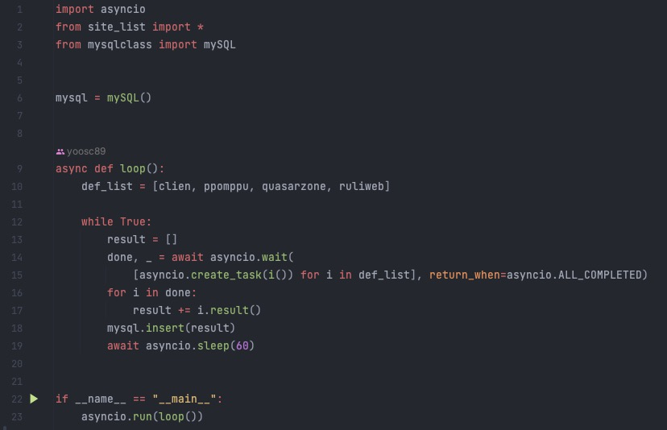

# [사이트별 알뜰 구매 정보를 모아서 표시해주는 사이트](https://github.com/yoosc89/web-svlete-alttuel) <- Link Github Repository

 

# 기술 스텍
DB : PostgreSQL  
Backend : Java, Python  
Backend Framwork : SpringBoot  
Frontend : HTML, Javascript, CSS  
Frontend WebFramework : Svelte, Bootstrap  
Server : Nginx  
Other : Docker
IDE : VScode  

 

# 목적
1. 토이 프로젝트로 파이썬을 이용한 크롤링을 통해 이미 등록해 놓은 사이트(클리앙, 루리웹, 뽐뿌 등)의 알뜰게시판의 타이틀과 같은 축약된 정보를 DB에 적재하여 보여주는 정보 취합 사이트를 구축

2. Docker Replicas를 이용한 Nginx, Spring Boot 각 서버의 무중단 배포

 

# 구현 스크린샷

## [주요 코드(크롤링) - 비동기 크롤링](https://github.com/yoosc89/web-svlete-alttuel/blob/master/crawlling/start.py) <- Link Github Repository

 
 
 
