# 개인 공부용 GIT REPOSITORY

개발 공부를 위한 레포지토리이며,  
진행했던 프로젝트의 경우, 설명은 Project 폴더애 있으며,  
Project 각 폴더에 해당하는 레포지토리로 연결하는 링크가 포함되어 있습니다.

# Skill Stack
<table>
   <tr>
      <td>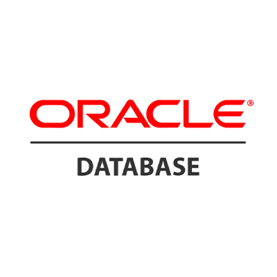</td>
      <td>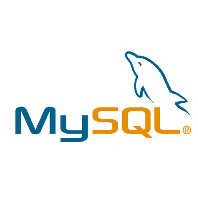</td>
      <td>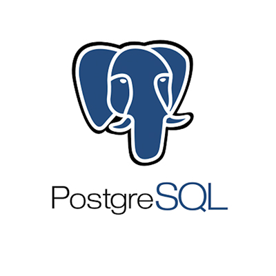</td>
   </tr>
   <tr>
      <td>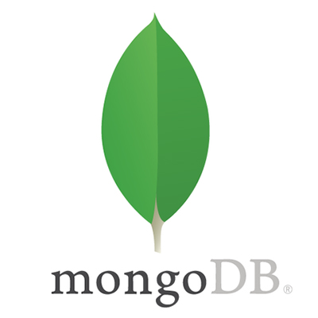</td>
      <td>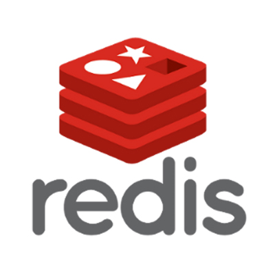</td>
   </tr>
   <tr>
      <td>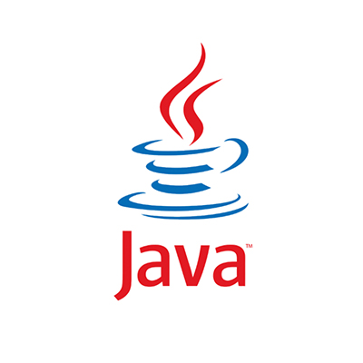</td>
      <td>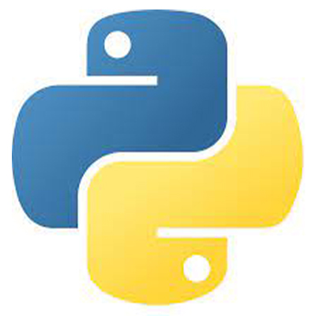</td>
      <td></td>
      <td>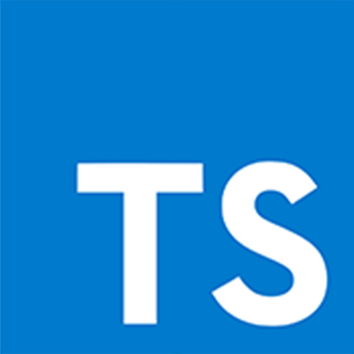</td>
   </tr>
   <tr>
      <td>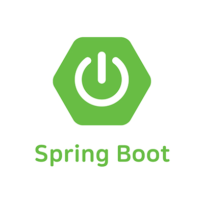</td>
      <td>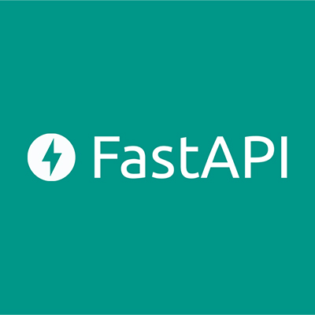</td>
      <td>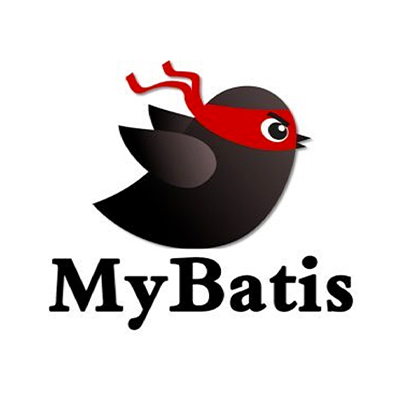</td>
      <td>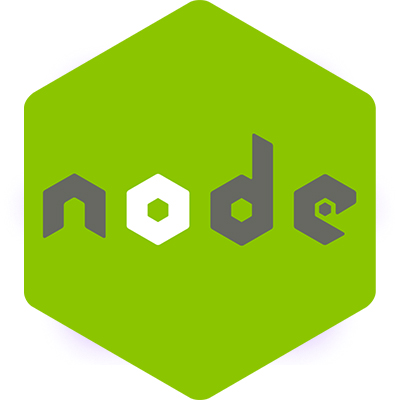</td>
   </tr>
   <tr>
      <td></td>
      <td>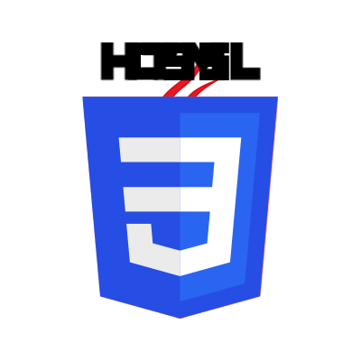</td>
      <td></td>
      <td></td>
   </tr>
   <tr>
      <td>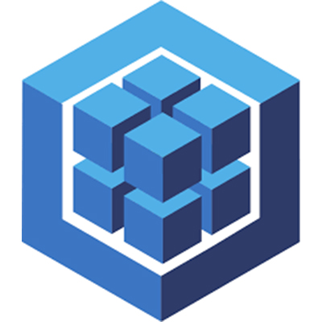</td>
   </tr>
   <tr>
      <td>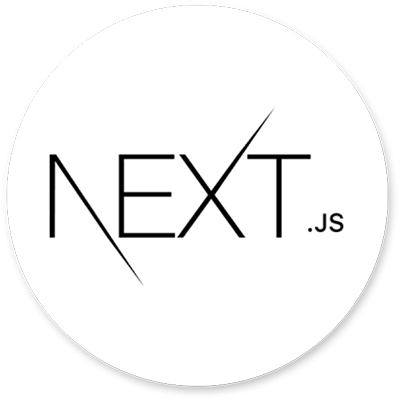</td>
      <td></td>
      <td>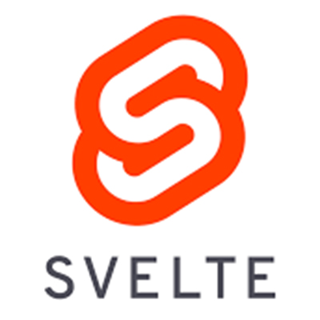</td>
      <td></td>
   </tr>
   <tr>
      <td>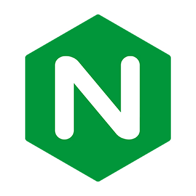</td>
      <td>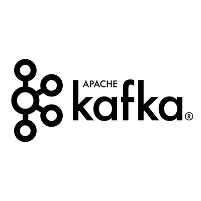</td>
      <td>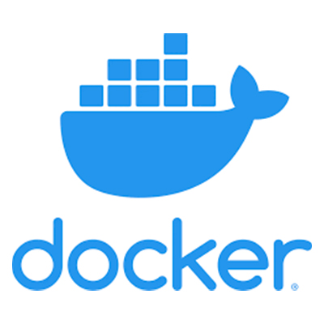</td>
   </tr>
   <tr>
      <td></td>
      <td>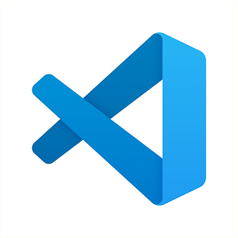</td>
      <td>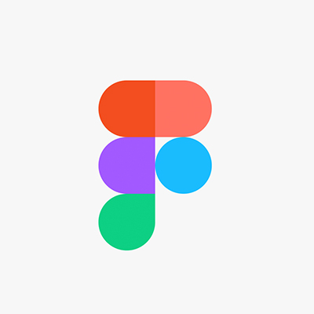</td>
      <td></td>
   </tr>
</table>

# ProjectList
1. [팀] OSMAS(Punding Site) 개요 : [Repository-Link](./Project/OSMAS/)
2. [팀] INFOMATE(OFFICE GROUPWARE) 개요 : [Repository-link](./Project/INFOMATE/)
3. [개인] Alttuel(Crawlling Site) 개요 : [Repository-Link](./Project/alttuel/)
4. [개인] CRM(CRM) 개요 : [Repository-Link](./Project/CRM/)

 

# Study History
2023-10-13 [scss](./Langauge/Markup/CSS/Scss/) scss 학습, springbooCache 학습 
2023-10-12 [kotlin](./Langauge/Kotlin/src/main/kotlin/) 코틀린 기본 문법 공부 확자함수, optional 처리 
2023-10-11 [kotlin](./Langauge/Kotlin/src/main/kotlin/) 코틀린 기본 문법 공부 funtion, class, scopeFunction 
2023-10-10 [kotlin](./Langauge/Kotlin/src/main/kotlin/) 코틀린 기본 문법 공부 
2023-10-09 [java](./Other/DesignPattern/02_Structual/01_Adapter/) adapter, facade pattern 개념 공부 
2023-10-08 [java](./Langauge/Java/Core/keyword/) 싱글톤 패턴 or synchronized 및 volatile 개념 공부 
2023-10-07 [disignPattern](./Other/DesignPattern/01_Creational/03_FactoryMethod/) 팩토리 메서드 패턴 학습 
2023-10-04 [disignPattern](./Other/DesignPattern/03_Behavioral/07_Observer/) observer, decorator 패턴 학습 
2023-09-27 ~ 10-03 [nodeJs](https://github.com/yoosc89/informate_back_nodeJs) Springboot RestAPI 서버를 nodeJS 서버로 마이그레이션 진행  
2023-09-27 [nodejs](./Langauge/JavaScript/Framework/NodeJs/) nodejs 배포 공부 
2023-09-27 [typescript](./Langauge/JavaScript/Framework/Typescript/) typescript 학습 
2023-09-26 [nodejs](./Langauge/JavaScript/Framework/NodeJs/) api server cors jwt 기능 구현 
2023-09-25 [nodejs](./Langauge/JavaScript/Framework/NodeJs/) passport를 통해 로그인 기능 구현 
2023-09-24 [nodejs](./Langauge/JavaScript/Framework/NodeJs/) nodejs DB연결 
2023-09-23 [nodejs](./Langauge/JavaScript/Framework/NodeJs/) nodejs 공부 
2023-09-22 [nodejs](./Langauge/JavaScript/Framework/NodeJs/) nodejs 기초 공부 
2023-09-21 [codetest](./Other/DataStructure/Algolithm//03_search/) 그리디 알고리즘 이용 목표값에 대한 최적의 수 찾기 
2023-09-20 [codetest](./Other/DataStructure/Algolithm/03_search/) 이진 탐색 활용 2차원 배열 원하는 위치의 값 구하기 
2023-09-18 [codetest](./Other/DataStructure/Algolithm/03_search/) 이진 탐색 활용 
2023-09-17 [codetest](./Other/DataStructure/Algolithm/03_search/) 이진 탐색 
2023-09-16 [infomate]() 프로젝트 후기 stompjs 방식의 웹 소켓 연결 
2023-09-15 [Codetest](./Other/DataStructure/Algolithm/03_search/) BFS을 이용한 2차원 배열 최소 경로 찾기 
2023-09-14  종강 
2023-09-13  파이널 프로젝트 테스트 
2023-09-12  파이널 프로젝트 테스트 
2023-09-11 [Codetest](./Other/DataStructure/Algolithm/03_search/) BFS 넓이 우선 탐색 
2023-09-10  파이널 프로젝트 집중 
2023-09-09  파이널 프로젝트 집중 
2023-09-08  파이널 프로젝트 집중 
2023-09-07  파이널 프로젝트 집중 
2023-09-06  파이널 프로젝트 집중 
2023-09-05  파이널 프로젝트 집중 
2023-09-04  파이널 프로젝트 집중 
2023-09-03 [Codetest](./Other/DataStructure/Algolithm/03_search/) 깊은 우선 탐색을 이용한 소수 찾기, 인접하여 연결된 관계가 있는 지 확인 
2023-09-02 [Codetest](./Other/DataStructure/Algolithm/02_sort/) 퀵정렬을 이용한 K번째 수 구하기, 스왑 갯수 구하기 
2023-09-01  파이널 프로젝트 집중 
2023-08-31  파이널 프로젝트 집중 
2023-08-30  파이널 프로젝트 집중 
2023-08-29  파이널 프로젝트 집중 
2023-08-28 [java](./Langauge/Java/Core/lamda/) 스트림 문법 재 학습 
2023-08-23-27  파이널 프로젝트 집중 
2023-08-22 [java](./Langauge/Java/Core/lamda/) 함수형 인터페이스 사용 공부 
2023-08-21  파이널 프로젝트 집중 
2023-08-20 [Codetest](./Other/DataStructure/Algolithm/02_sort/) 버블, 선택 삽입 정렬 코테 공부 
2023-08-19 [React](./Langauge/JavaScript/Library/StompJS/) StompJS를 이용한 웹소켓 연결 
2023-08-17-18  파이널 프로젝트 중 
2023-08-16 [ReactivePrograming](./Langauge/Java/Reactive/02_Reactor/Core/) Flux 속도 차이 분석 
2023-08-15 [Codetest](./Other/DataStructure/Algolithm/01_list/) 스택, 큐를 이용한 수열의 오름차순 
2023-08-13 [Codetest](./Other/DataStructure/Algolithm/01_list/) 배열에서 조건에 맞는 두수의 합, 좋은수 찾기 
2023-08-13 [MongoDB](./DB/NOSQL/MongoDB/90_Schema/) DB 설계시 주의 사항 및 스키마 패턴 공부 
2023-08-12 [MongoDB](./DB/NOSQL/MongoDB/03_Document/index.mongodb.js) indexing공부 
2023-08-09 [Codetest](./Other/DataStructure/Algolithm/01_list/) 코드테스트 배열 누적 합계 계산 
2023-08-09 [Codetest](./Other/DataStructure/Algolithm/01_list/) 코드테스트 나머지가 0이 되는 경우의 수 계산 
2023-08-08 [Codetest](./Other/DataStructure/Algolithm/01_list/) 코드테스트 공부 시작 
2023-08-06 [ReactivePrograming](./Langauge/Java/Reactive/) sequnce, Backpressure, Sink 공부 
2023-08-05 [ReactivePrograming](./Langauge/Java/Reactive/) 개념, 규칙 공부 
2023-08-03 [springboot](./Langauge/Java/Framework/Spring/async/) 비동기 처리 
2023-08-02 [kafka](./Platform/Kafka/99studyProject/02springboot/init/) stomp 코드 안정화 
2023-08-02 kafka 채팅 서버 레포지토리 분리 
2023-08-01 [kafka](./Platform/Kafka/99studyProject/02springboot/init/) kafka Springboot websocket stomp 방식 연결 성공 
2023-07-31 [kafka](./Platform/Kafka/99studyProject/02springboot/init/) kafka Springboot 객체 전달을위한 Json직렬화(JsonSerializer) 및 역직렬화(JsonDeserializer) 세팅 
2023-07-30 [kafka](./Platform/Kafka/99studyProject/02springboot/init/) kafka Springboot 연동 기초 
2023-07-29 [MongoDB](./DB//NOSQL/MongoDB/) cursor, $where function() 함수 사용 체험, limit, count, skip sort 공부,Spring boot jpa를 이용한 mongoDB 연동 
2023-07-28 [MongoDB](./DB//NOSQL/MongoDB/) update $inc 연산자 및 find 배열 스라이드 및 검색 
2023-07-26 [MongoDB](./DB//NOSQL/MongoDB/) 정규표현식 패턴 및 사용 방법, update 구문 사용 방법 
2023-07-25 [Kafka](./Platform/Kafka/) 카프카 프로듀서 개념 
2023-07-24 [MongoDB](./DB//NOSQL/MongoDB/) 조건문 
2023-07-24 [Kafka](./Platform/Kafka/) 카프카 개념 
2023-07-23 [MongoDB](./DB//NOSQL/MongoDB/) collection 조회 및 document insert, find 
2023-07-22 [ShellScript](./Langauge/ShellScript/) 파일생성 스크립트 인식 
2023-07-21 [Notion](https://certain-allspice-c69.notion.site/Dev-Study-58e7068499db4c8d8e0dc4250d5d44de?pvs=4) notion에서 github로 이전 
2023-07-21 [MongoDB](./DB//NOSQL/MongoDB/) 기본 개념 및 구조, 컬렉력 및 DB 조회 및 insert 명령어 체험 